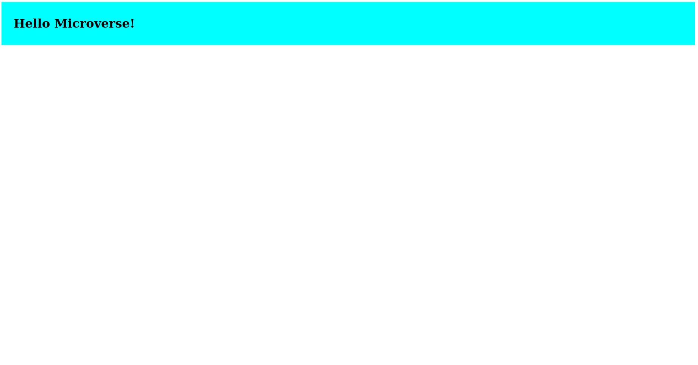

# Hello Microverse

> A simple HTML and CSS project built to master Microverse teams tools and best practices.

The project has a header with a "Hello Microverse" heading.

## Built With

- HTML, CSS

## Getting Started

To get a local copy up and running follow these simple example steps.

### Prerequisites

- Node v12 updards

- Lighthouse

- Webhint

- Stylelint

### Setup

1.  Open a terminal, navigate to the directory that you would like to clone the repository into using commands like:

    - `cd /pathname` to change your working directory.

2.  Next, clone the remote repository and create a local copy on your machine using this command:

    - `git clone https://github.com/afizsavage/Hello-microverse.git`

3.  Now you can see the contents of the remote repository on your machine by moving into the newly cloned directory:

    - `cd Hello-microverse`
    - `ls -la`

### Run

Open the index.html file in the a browser

## Author

👤 **Afiz Savage**

- GitHub: [@githubhandle](https://github.com/afizsavage)
- Twitter: [@twitterhandle](https://twitter.com/fizzo_geek)
- LinkedIn: [LinkedIn](https://www.linkedin.com/in/afiz-savage-3b91a21ba/)

## Show your support

Give a ⭐️ if you like this project!
